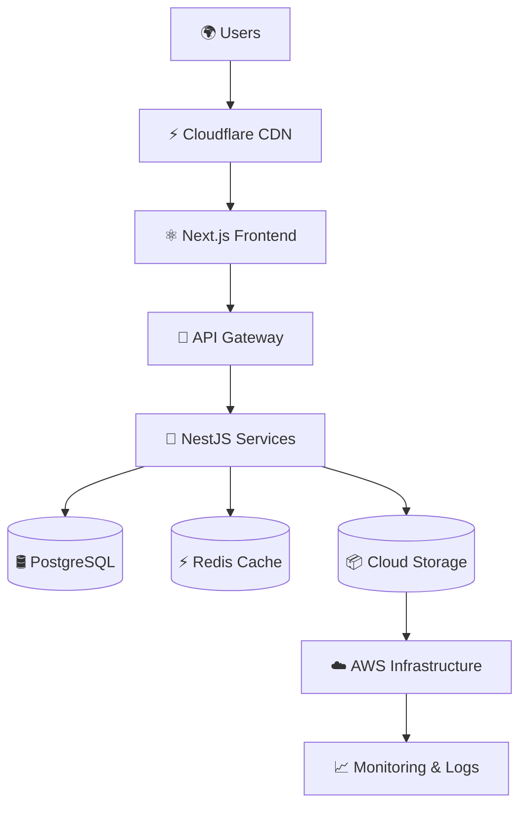
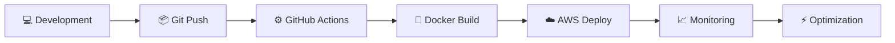

# 🌌 AVIRAL OS — FULL STACK ENGINEERING SYSTEM

<div align="center">


<br/>


<br/><br/>


</div>

---

# 🛰️ DIGITAL IDENTITY

<div align="center">

```bash
┌──────────────────────────────────────┐
│ AVIRAL MISHRA                        │
├──────────────────────────────────────┤
│ ROLE      → Full Stack Engineer      │
│ STACK     → MERN + Next.js           │
│ CLOUD     → AWS + Docker             │
│ AI        → Automation Systems       │
│ FOCUS     → SaaS Architecture        │
│ STATUS    → Building & Scaling       │
│ LOCATION  → India 🇮🇳                │
└──────────────────────────────────────┘
```

</div>

---

# ⚡ ENGINEERING DASHBOARD

<div align="center">

```bash
STATUS            : ONLINE
CURRENT_BUILD     : Smart SaaS Ecosystem
RUNTIME           : Next.js + NestJS
DEPLOYMENT        : Docker + AWS
DATABASE_LAYER    : PostgreSQL + MongoDB
AI_LAYER          : OpenAI Integrations
ARCHITECTURE      : Scalable Cloud Systems
UPTIME            : 99.9%
MISSION           : Build • Scale • Optimize
```

</div>

---

# 🌌 3D TECH ECOSYSTEM

<div align="center">

<table>
<tr>
<td width="33%" valign="top">

## ⚛️ FRONTEND LAYER

```txt
Frontend System
│
├── React Ecosystem
├── Next.js Architecture
├── TypeScript Engine
├── Tailwind UI Systems
├── Framer Motion
├── Redux State Layer
└── Performance Optimization
```


</td>

<td width="33%" valign="top">

## 🚀 BACKEND CORE

```txt
Backend Infrastructure
│
├── NestJS APIs
├── Node.js Runtime
├── Authentication Systems
├── PostgreSQL
├── MongoDB
├── Prisma ORM
└── REST Architecture
```


</td>

<td width="33%" valign="top">

## ☁️ CLOUD & DEVOPS

```txt
Cloud Operations
│
├── Docker Containers
├── AWS Infrastructure
├── CI/CD Pipelines
├── GitHub Actions
├── Linux Systems
├── Monitoring
└── Production Deployments
```


</td>
</tr>
</table>

</div>

---

# 🧠 FULL STACK POWER LEVEL

<div align="center">

```txt
Frontend Engineering   ██████████████░   95%
Backend Systems        ████████████░░░   88%
Cloud & DevOps         ██████████░░░░░   75%
UI/UX Engineering      █████████████░░   90%
System Architecture    ███████████░░░░   82%
AI Integrations        █████████░░░░░░   70%
```

</div>

---

# 🚀 ACTIVE MISSIONS

<div align="center">

```txt
[ ACTIVE PROJECTS ]

◉ Smart Waste ERP Platform
◉ SaaS Dashboard Ecosystem
◉ AI Workflow Automation
◉ Cloud Native Infrastructure
◉ High Performance UI Systems
◉ Production Ready APIs
```

</div>

---

# 🌐 AI ENGINEERING SYSTEM

<div align="center">

```txt
AI INTEGRATIONS
│
├── OpenAI APIs
├── AI Workflow Systems
├── Automation Pipelines
├── Smart SaaS Features
├── AI Chat Systems
└── Intelligent User Experiences
```

</div>

---

# 🛰️ CLOUD ARCHITECTURE

<div align="center">



</div>

---

# ⚡ DEVOPS PIPELINE

<div align="center">



</div>

---

# 📊 GITHUB ANALYTICS

<div align="center">


<br/><br/>


</div>

---

# 📈 CONTRIBUTION MATRIX

<div align="center">


</div>

---

# 🐍 CONTRIBUTION SNAKE

<div align="center">


</div>

---

# 🏆 ENGINEERING ACHIEVEMENTS

<div align="center">


</div>

---

# 🎧 CODING ENVIRONMENT

<div align="center">


</div>

---

# 🌐 CONNECT TERMINAL

<div align="center">

<a href="https://github.com/Aviral-1">

</a>

<a href="https://linkedin.com/in/yourlinkedin">

</a>

<a href="mailto:youremail@example.com">

</a>

<a href="https://twitter.com/">

</a>

</div>

---

# ⚡ ENGINEERING PHILOSOPHY

<div align="center">

```txt
Building scalable SaaS ecosystems with modern frontend engineering,
cloud infrastructure, and AI-powered systems.
```

</div>

---

<div align="center">


</div>

