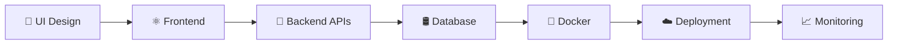

<!-- 🌌 AVIRAL MISHRA — ULTRA MODERN ANIMATED GITHUB README 🌌 -->

<div align="center">


</div>

---

<div align="center">


<br/>


</div>

---

#  About Me


```yaml
name: Aviral Mishra
role: Full Stack Developer
specialization:
  - React.js
  - Next.js
  - NestJS
  - TypeScript
  - Docker
  - DevOps

currently_learning:
  - AWS
  - CI/CD
  - System Design
  - Scalable Architectures

passion:
  - Building SaaS Products
  - Solving Production Issues
  - UI/UX Enhancement
  - Performance Optimization
```

<br clear="both"/>

---

# ⚡ Tech Universe

<div align="center">


</div>

---

# 🚀 Animated Developer Metrics

<div align="center">


</div>

---

# 📊 Contribution Analytics

<div align="center">


</div>

---

# 🧠 Advanced GitHub Analytics

<div align="center">


<br/>


</div>

---

# 🏆 Achievement Showcase

<div align="center">


</div>

---

# 🌌 Dynamic Coding Quote

<div align="center">


</div>

---

# 🐍 Contribution Snake Animation

<div align="center">


</div>

---

# 💻 Current Workflow

<div align="center">



</div>

---

# 🔥 Current Focus

<div align="center">

<table>
<tr>
<td align="center" width="33%">

### ⚛️ Frontend
Next.js  
Animations  
Modern UI  
Performance  

</td>

<td align="center" width="33%">

### 🚀 Backend
NestJS  
REST APIs  
Architecture  
Optimization  

</td>

<td align="center" width="33%">

### ☁️ DevOps
Docker  
AWS  
CI/CD  
Automation  

</td>
</tr>
</table>

</div>

---

# 🌐 Connect With Me

<div align="center">

<a href="https://github.com/Aviral-1">
  
</a>

<a href="https://linkedin.com/in/yourlinkedin">
  
</a>

<a href="mailto:youremail@example.com">
  
</a>

<a href="https://twitter.com/">
  
</a>

</div>

---

# ⚡ Fun Developer Fact

<div align="center">


</div>

---

<div align="center">


## 🚀 “Code. Create. Scale. Repeat.”

</div>
