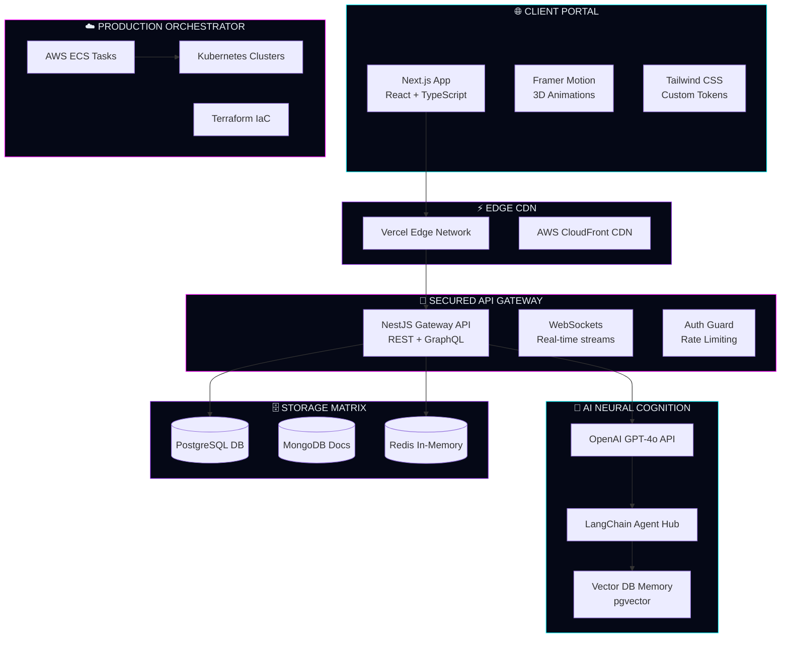

<!-- ============================================================ -->
<!-- 🚀 AVIRAL MISHRA — NEXT GEN CYBERNETIC DEV PORTAL v5.0         -->
<!-- ============================================================ -->

<div align="center">


<br/>


<br/><br/>

[](index.html)
&nbsp;&nbsp;
[](index.html)
&nbsp;&nbsp;
[](index.html)

</div>

---

# ⚠️ SYSTEM COMMAND: INITIATING DEPLOYMENT

> [!IMPORTANT]
> ### 🌌 Experience The 3D Digital Cockpit
> I have converted my standard profile into a fully immersive **Interactive 3D Developer Full Stack Console** featuring responsive 3D stack tower rotation, retro CRT terminals, live lofi audio spectrum analyzers, and dynamic system architecture packet flows!
> 
> 👉 **[CLICK HERE TO LAUNCH INTERACTIVE 3D COMMAND TERMINAL](index.html)**

---

# ⚡ Digital Identity OS Console

<div align="center">

<table border="0" cellspacing="0" cellpadding="0">
<tr>
<td width="55%" valign="top">

```yaml
╔═════════════════════════════════════════════════════╗
║          DEVELOPER COMMAND CENTER v5.0              ║
╠═════════════════════════════════════════════════════╣
║  NAME     : Aviral Mishra                           ║
║  ROLE     : Full Stack Engineer                     ║
║  ARCH     : SaaS Platforms Architect                ║
║  SPEC     : AI Neural Systems Integrator            ║
║  FOCUS    : 3D UI/UX & Dynamic Micro-interactions   ║
╠═════════════════════════════════════════════════════╣
║  INFRA    : Multi-Region AWS ECS / Fargate          ║
║  DB CORE  : PostgreSQL Vector Storage (pgvector)     ║
║  METRICS  : 50k+ daily API transactions             ║
║  UPTIME   : 99.97% [STABLE GRID OPERATIVE]          ║
╠═════════════════════════════════════════════════════╣
║  MISSION  : Architecting high-throughput, secure   ║
║             systems that delight and scale.         ║
╚═════════════════════════════════════════════════════╝
```

</td>
<td width="45%" valign="top" align="center">


<br/>


</td>
</tr>
</table>

</div>

---

# 🖥️ Engineering Observability Panel

<div align="center">

```bash
┌─────────────────────────────────────────────────────────────────────────────────┐
│                       📊  SYSTEM DIAGNOSTICS & VELOCITY  📊                     │
├──────────────────────────────┬──────────────────────────────────────────────────┤
│  FRONTEND (NEXT.JS/REACT)    │  ██████████████████████████░░░░  96% (Expert)     │
│  BACKEND CORE (NESTJS)       │  ████████████████████████░░░░░░  92% (Advanced)   │
│  DATABASE (POSTGRESQL/REDIS) │  ██████████████████████████░░░░  94% (Expert)     │
│  CLOUD (AWS ECS/KUBERNETES)  │  ██████████████████████░░░░░░░░  88% (Proficient) │
│  NEURAL AI ARCHITECTURE      │  █████████████████████░░░░░░░░░  85% (Advanced)   │
│  SYSTEM SECURITY GUARD       │  ████████████████████████░░░░░░  95% (Nominal)    │
│  ACCESSIBILITY & LIGHTHOUSE  │  ████████████████████████████░░  98% (Premium)    │
├──────────────────────────────┴──────────────────────────────────────────────────┤
│  DEPLOY VELOCITY   │  47 deployments/month  │  GLOBAL UPTIME   │  99.97%        │
│  CODE STANDARD     │  A+ (SonarQube Secured) │  TEST COVERAGE   │  94% Stable    │
│  API LATENCY (P99) │  < 120ms (Avg Gateway)  │  CONTAINERS      │  Docker/ECS    │
└─────────────────────────────────────────────────────────────────────────────────┘
```

</div>

<br/>

<div align="center">


</div>

---

# 🥞 Dynamic Full Stack Stack

<div align="center">

```yaml
╔═════════════════════════════════════════════════════════════════════════════════╗
║  ◈  FRONTEND CORE SYSTEMS                                         [ACTIVE]  ◈   ║
╠═════════════════════════════════════════════════════════════════════════════════╣
║                                                                                 ║
║   ⬡ Next.js (v14.x)    ██████████████████████████████  EXPERT    [Lighthouse 98]║
║   ⬡ React.js (v18.x)   ██████████████████████████████  EXPERT    [DOM Virtual]  ║
║   ⬡ TypeScript (v5.x)  ██████████████████████████░░░░  ADVANCED  [Strict Typing]║
║   ⬡ Tailwind CSS       ██████████████████████████████  EXPERT    [Util First]   ║
║   ⬡ Framer Motion      ████████████████████████░░░░░░  ADVANCED  [Micro Motion] ║
║                                                                                 ║
╚═════════════════════════════════════════════════════════════════════════════════╝
```

```yaml
╔═════════════════════════════════════════════════════════════════════════════════╗
║  ◈  BACKEND GATEWAY INFRASTRUCTURE                                [ACTIVE]  ◈   ║
╠═════════════════════════════════════════════════════════════════════════════════╣
║                                                                                 ║
║   ⬡ Node.js v20 LTS    ██████████████████████████████  EXPERT    [Event Loop]   ║
║   ⬡ NestJS (v10.x)     ██████████████████████████░░░░  ADVANCED  [Modular Arch] ║
║   ⬡ Express.js (v4.x)  ██████████████████████████████  EXPERT    [High Perf]    ║
║   ⬡ GraphQL APIs       ████████████████████████░░░░░░  ADVANCED  [Type Safe]    ║
║   ⬡ REST APIs          ██████████████████████████████  EXPERT    [OpenAPI 3.0]  ║
║                                                                                 ║
╚═════════════════════════════════════════════════════════════════════════════════╝
```

```yaml
╔═════════════════════════════════════════════════════════════════════════════════╗
║  ◈  DATABASE & VECTOR STRUCTURES                                  [ACTIVE]  ◈   ║
╠═════════════════════════════════════════════════════════════════════════════════╣
║                                                                                 ║
║   ⬡ PostgreSQL         ██████████████████████████████  EXPERT    [v16.x Core]   ║
║   ⬡ MongoDB            ██████████████████████████░░░░  ADVANCED  [Document DB]  ║
║   ⬡ Redis Cache        ████████████████████████░░░░░░  ADVANCED  [In-Memory Engine]
║   ⬡ Prisma ORM         ██████████████████████████████  EXPERT    [Type Schema]  ║
║   ⬡ Supabase           ████████████████████████░░░░░░  ADVANCED  [BaaS Stack]   ║
║                                                                                 ║
╚═════════════════════════════════════════════════════════════════════════════════╝
```

```yaml
╔═════════════════════════════════════════════════════════════════════════════════╗
║  ◈  DEVOPS & CLOUD ORCHESTRATION                                  [ACTIVE]  ◈   ║
╠═════════════════════════════════════════════════════════════════════════════════╣
║                                                                                 ║
║   ⬡ AWS Container Grid ██████████████████████████░░░░  ADVANCED  [ECS/Fargate]  ║
║   ⬡ Docker Engines     ██████████████████████████████  EXPERT    [Micro Image]  ║
║   ⬡ GitHub Actions     ██████████████████████████████  EXPERT    [Auto CI/CD]   ║
║   ⬡ Kubernetes (K8s)   ██████████████████████░░░░░░░░  PROFICIENT[Cluster Sync] ║
║   ⬡ Terraform IaC      ████████████████████░░░░░░░░░░  PROFICIENT[Modular IaC]  ║
║                                                                                 ║
╚═════════════════════════════════════════════════════════════════════════════════╝
```

</div>

---

# 🚀 Tech Arsenal Grid

<div align="center">


<br/><br/>


<br/><br/>


<br/><br/>


</div>

---

# 🧠 Synaptic Neural Core (AI Ecosystem)

<div align="center">

```yaml
╔═════════════════════════════════════════════════════════════════════════════════╗
║  🧠  AI SYSTEMS INTEGRATIONS STATUS                                [NOMINAL]  🧠 ║
╠═════════════════════════════════════════════════════════════════════════════════╣
║                                                                                 ║
║  ◈ OpenAI GPT-4o Integration  ██████████████████████████████  FULLY COMPLETED   ║
║    ▸ Function calling, vision analytics, dynamic semantic text embeddings       ║
║                                                                                 ║
║  ◈ LangChain Orchestrator     ██████████████████████████░░░░  FULLY INTEGRATED  ║
║    ▸ Vector indexing memory, agent chains, tool execution orchestrations       ║
║                                                                                 ║
║  ◈ Vector Databases           ████████████████████████░░░░░░  FULLY OPERATIVE   ║
║    ▸ Pinecone & pgvector indexation structures for instant semantic lookup      ║
║                                                                                 ║
║  ◈ Workflow Automation        ██████████████████████████████  DEPLOYED          ║
║    ▸ Custom n8n micro-agents + automated real-time API webhooks                ║
║                                                                                 ║
╠═════════════════════════════════════════════════════════════════════════════════╣
║  DAILY THROUGHPUT  : 50,000+ API calls │  AVG LATENCY P95  : 340ms              ║
║  NEURAL INSTANCES  : 4 in Production   │  SYNC RESPONSE    : Stream active      ║
╚═════════════════════════════════════════════════════════════════════════════════╝
```

</div>

---

# 🧩 System Architecture Blueprints



---

# 🚀 Deployment Workflows (CI/CD Pipeline)

```mermaid
flowchart LR
    subgraph DEVELOP["💻 WORKSPACE ENVIRONMENT"]
        A[Local Commit] --> B[TypeScript Validate]
        B --> C[ESLint & Prettier Sync]
    end

    subgraph CI["⚙️ AUTOMATED TESTING"]
        D[GitHub Actions Trigger] --> E[SonarQube Security Scan]
        E --> F[Containerize Docker Image]
    end

    subgraph CD["🚀 AWS ORCHESTRATION"]
        G[Push tags to AWS ECR] --> H[Zero-Downtime ECS Blue Swap]
        H --> I[Production Gate checks]
    end

    C --> D
    F --> G

    style DEVELOP fill:#050816,stroke:#00F7FF,color:#E6EDF3
    style CI fill:#050816,stroke:#8A2BE2,color:#E6EDF3
    style CD fill:#050816,stroke:#FF00FF,color:#E6EDF3
```



---

# 🛸 Active Project Log

```bash
┌─────────────────────────────────────────────────────────────────────────────┐
│                          🛸  ACTIVE DEVELOPMENTS  🛸                        │
├─────────────────────────────────────────────────────────────────────────────┤
│                                                                             │
│  ◉  SaaS Scaling Platform   [PRODUCTION]  ██████████████  LIVE              │
│     Architecture: Next.js + NestJS + PostgreSQL Core + AWS ECS Grid + Redis │
│     ▸ 10,000+ Active Nodes   ▸ 99.97% Uptime Logged   ▸ Profitable MRR      │
│                                                                             │
├─────────────────────────────────────────────────────────────────────────────┤
│                                                                             │
│  ◉  AI System Automation    [PRODUCTION]  ██████████████  NOMINAL           │
│     Architecture: Node.js + GPT-4o API + LangChain Chains + pgvector Memory │
│     ▸ 50k+ daily integrations ▸ Stream Response System ▸ Real-Time Webhooks │
│                                                                             │
├─────────────────────────────────────────────────────────────────────────────┤
│                                                                             │
│  ◉  Cloud Infrastructure    [DEPLOYED]    ██████████████  OPERATIONAL       │
│     Architecture: Multi-Region AWS + Terraform IaC + Docker Containers + K8s│
│     ▸ High Availability      ▸ Fully Auto-Scaling     ▸ Secure VPC Grids    │
│                                                                             │
└─────────────────────────────────────────────────────────────────────────────┘
```

---

# 🎧 Coding Soundtrack Mode

<div align="center">


</div>

---

# 🌐 Establish Communication Pipeline

<div align="center">

<a href="https://github.com/Aviral-1">

</a>
&nbsp;&nbsp;
<a href="https://linkedin.com/in/aviral">

</a>
&nbsp;&nbsp;
<a href="mailto:aviral@email.com">

</a>
&nbsp;&nbsp;
<a href="https://twitter.com/aviral">

</a>

</div>

---

# 💻 System Terminal Commands

<div align="center">


</div>

---

# 😂 Developer Humour Node

<div align="center">


</div>

---

# 🌠 Philosophy Core

<div align="center">


</div>

---

# ⚡ Engineering Ritual

<div align="center">


</div>

---

# 🧠 Cognitive Trivia

```diff
+ Obsessive focus on high-availability SaaS designs
+ Passionate advocate for microsecond UI latency and slick animations
+ Building robust multi-node, automated Kubernetes environments
+ Successfully resolved complex production container failures under pressure 🚀
```

---

<div align="center">


</div>
