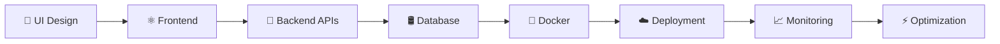

# ⚡ About Me

<div align="center">

<table>
<tr>
<td width="55%" valign="top">


<br/><br/>

```yaml
name: Aviral Mishra

role: Full Stack Engineer

specialization:
  - Modern SaaS Applications
  - Frontend Architecture
  - Backend Systems
  - DevOps & Automation
  - High Performance UI

frontend:
  - React.js
  - Next.js
  - TypeScript
  - Tailwind CSS
  - Framer Motion

backend:
  - NestJS
  - Express.js
  - PostgreSQL
  - MongoDB

devops:
  - Docker
  - AWS
  - GitHub Actions
  - CI/CD
  - Linux

currently_learning:
  - Kubernetes
  - System Design
  - Cloud Infrastructure
  - AI Integrations

motto:
  "Design • Develop • Deploy • Scale"
```

</td>

<td width="45%" align="center">


<br/><br/>


<br/>


<br/>


</td>

</tr>
</table>

</div>

---

# 🚀 Developer Highlights

<div align="center">

<table>
<tr>

<td width="33%" align="center">


### ⚛️ Frontend

```diff
+ Modern UI/UX
+ Responsive Design
+ Framer Motion
+ SaaS Dashboards
```

</td>

<td width="33%" align="center">


### 🚀 Backend

```yaml
- REST APIs
- Authentication
- PostgreSQL
- System Design
```

</td>

<td width="33%" align="center">


### ☁️ DevOps

```bash
Docker
AWS
CI/CD
Automation
Linux
```

</td>

</tr>
</table>

</div>

---

# ⚡ Engineering Workflow

<div align="center">



</div>

---

# 🧠 Developer Philosophy

<div align="center">


</div>

---

# ⚡ Fun Facts

<div align="center">

```diff
+ Passionate about scalable SaaS applications
+ Love modern UI/UX experiences
+ Production bug fixer 🚀
+ Clean code enthusiast ⚡
+ Always exploring new technologies
```

</div>

---
