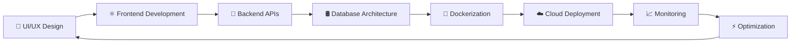
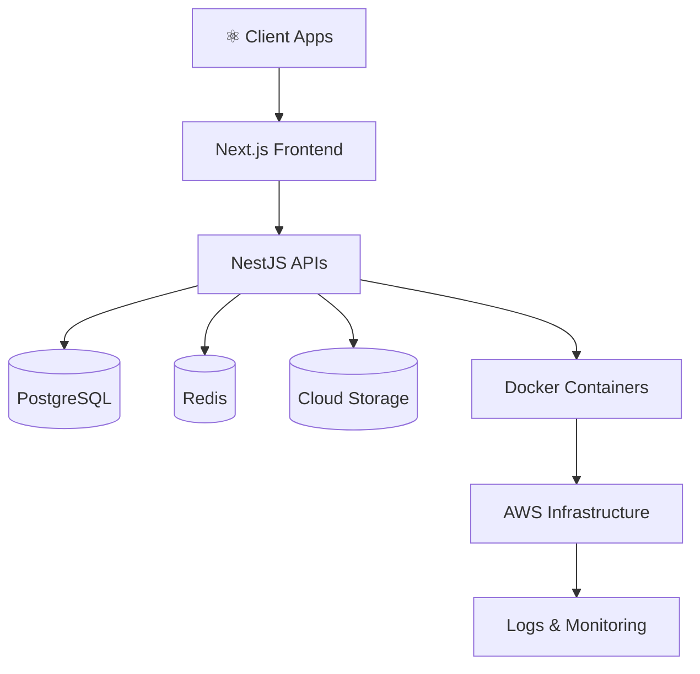

<!-- ========================================= -->
<!-- 🚀 AVIRAL MISHRA — NEXT GEN DEVELOPER README -->
<!-- ========================================= -->

<div align="center">


<br/>


<br/><br/>


</div>

---

# ⚡ About Me

<div align="center">

<table>
<tr border="none">

<td width="55%" valign="top">

## 👨‍💻 Aviral Mishra


<br/>

<p align="left">


<br/>


<br/>


</p>

<br/>

```yaml
name: Aviral Mishra

role: Full Stack Engineer

location: India 🇮🇳

specialization:
  - Scalable SaaS Platforms
  - Frontend Architecture
  - Backend Engineering
  - DevOps Automation
  - Production Optimization

frontend:
  - React.js
  - Next.js
  - TypeScript
  - Tailwind CSS
  - Redux
  - Framer Motion

backend:
  - Node.js
  - NestJS
  - Express.js
  - PostgreSQL
  - MongoDB
  - Prisma ORM

devops:
  - Docker
  - AWS
  - CI/CD
  - GitHub Actions
  - Linux

currently_learning:
  - Kubernetes
  - AI Integrations
  - Cloud Architecture
  - System Design

focus:
  - Modern SaaS Products
  - UI/UX Engineering
  - Scalable Systems
  - Production Applications

motto:
  "Code • Build • Scale • Repeat"
```

</td>

<td width="45%" align="center">


<br/><br/>


<br/>


<br/>


<br/>


<br/><br/>


</td>

</tr>
</table>

</div>

---

# ⚡ Tech Arsenal

<div align="center">


</div>

---

# 🚀 Developer Highlights

<div align="center">

<table>
<tr>

<td align="center" width="33%">


### ⚛️ Frontend

```diff
+ Modern UI/UX
+ Responsive Design
+ Framer Motion
+ SaaS Dashboards
+ High Performance UI
+ Pixel Perfect Interfaces
```

</td>

<td align="center" width="33%">


### 🚀 Backend

```yaml
- REST APIs
- Authentication
- Database Design
- PostgreSQL
- Scalable Systems
- Production APIs
```

</td>

<td align="center" width="33%">


### ☁️ DevOps

```bash
Docker
AWS
CI/CD
Automation
Monitoring
Linux
Deployments
```

</td>

</tr>
</table>

</div>

---

# 🧠 Developer Mindset

<div align="center">

| 🚀 Focus Area | ⚡ Expertise |
|---|---|
| Frontend Engineering | Scalable UI Systems |
| Backend Architecture | REST APIs & Optimization |
| DevOps Engineering | CI/CD & Cloud Deployment |
| Problem Solving | Production Issue Resolution |
| UI/UX Design | Modern Product Interfaces |
| Performance | Speed & Scalability |
| Architecture | SaaS & Cloud Systems |
| Leadership | Team Collaboration |

</div>

---

# 🚀 GitHub Analytics

<div align="center">


<br/><br/>


<br/><br/>


</div>

---

# 📈 Contribution Graph

<div align="center">


</div>

---

# 🐍 Contribution Snake

<div align="center">


</div>

---

# 🏆 Achievement Showcase

<div align="center">


</div>

---

# 🌌 3D Contribution Calendar

<div align="center">


</div>

---

# ⚡ Engineering Workflow

<div align="center">



</div>

---

# 🧩 Architecture Vision

<div align="center">



</div>

---

# 🎧 Coding Mode

<div align="center">


</div>

---

# 🌐 Connect With Me

<div align="center">

<a href="https://github.com/Aviral-1">

</a>

<a href="https://linkedin.com/in/yourlinkedin">

</a>

<a href="mailto:youremail@example.com">

</a>

<a href="https://twitter.com/">

</a>

<a href="https://discord.com">

</a>

</div>

---

# 💻 Developer Terminal

<div align="center">


</div>

---

# 😂 Random Dev Joke

<div align="center">


</div>

---

# 🌌 Developer Philosophy

<div align="center">


</div>

---

# ⚡ Dev Lifestyle

<div align="center">


</div>

---

# 🧠 Fun Facts

<div align="center">

```diff
+ Passionate about scalable SaaS products
+ Love modern UI/UX experiences
+ Building production-ready applications
+ Solving real-world engineering problems
+ Debugging production issues like a pro 🚀
```

</div>

---

<div align="center">


</div>
