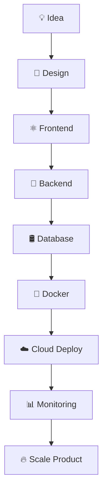

<!-- ===================================================== -->
<!-- 🚀 ULTRA PREMIUM CYBERPUNK GITHUB README - AVIRAL 🚀 -->
<!-- ===================================================== -->

<div align="center">


<br/>


<br/>


<br/><br/>


</div>

---

<div align="center">

# ⚡ SYSTEM.INIT()

</div>

<table>
<tr>
<td width="55%">

```typescript
class AviralMishra {

  name         = "Aviral Mishra";
  role         = "Full Stack Developer";
  location     = "India";

  languages    = [
    "JavaScript",
    "TypeScript",
    "SQL"
  ];

  frontend     = [
    "React.js",
    "Next.js",
    "Tailwind CSS",
    "Framer Motion"
  ];

  backend      = [
    "Node.js",
    "NestJS",
    "Express.js"
  ];

  databases    = [
    "MongoDB",
    "PostgreSQL",
    "MySQL"
  ];

  devops       = [
    "Docker",
    "AWS",
    "CI/CD",
    "Linux"
  ];

  currentlyLearning() {
    return [
      "System Design",
      "Microservices",
      "Cloud Scaling",
      "Kubernetes"
    ];
  }

  lifeMotto() {
    return "Code • Create • Scale • Repeat 🚀";
  }
}
```

</td>

<td width="45%">

<div align="center">


</div>

</td>
</tr>
</table>

---

# 🌌 DIGITAL UNIVERSE

<div align="center">


</div>

---

# ⚡ TECH MATRIX

<div align="center">


</div>

---

# 🚀 PERFORMANCE ANALYTICS

<div align="center">


<br/><br/>


</div>

---

# 🧠 CURRENT MISSION

<div align="center">

<table>
<tr>

<td align="center" width="33%">


## ⚛️ FRONTEND

```diff
+ Next.js 15
+ Smooth Animations
+ Advanced UI/UX
+ Performance Optimization
```

</td>

<td align="center" width="33%">


## 🚀 BACKEND

```yaml
- NestJS APIs
- Authentication
- Scalable Architecture
- Production Optimization
```

</td>

<td align="center" width="33%">


## ☁️ DEVOPS

```bash
Docker
AWS
CI/CD
Cloud Infrastructure
```

</td>

</tr>
</table>

</div>

---

# 🐍 CONTRIBUTION SNAKE

<div align="center">


</div>

---

# 🏆 ACHIEVEMENTS

<div align="center">


</div>

---

# ⚙️ DEVELOPMENT PIPELINE

<div align="center">



</div>

---

# 🌐 CONNECT.PROTOCOL()

<div align="center">

<a href="https://github.com/Aviral-1">

</a>

<a href="https://linkedin.com">

</a>

<a href="mailto:yourmail@gmail.com">

</a>

<a href="https://twitter.com">

</a>

<a href="https://discord.com">

</a>

</div>

---

# 💀 LIVE TERMINAL

<div align="center">


</div>

---

# 🎧 NOW PLAYING

<div align="center">


</div>

---

# ⚡ FINAL_MESSAGE.EXE

<div align="center">


<br/><br/>


</div>
