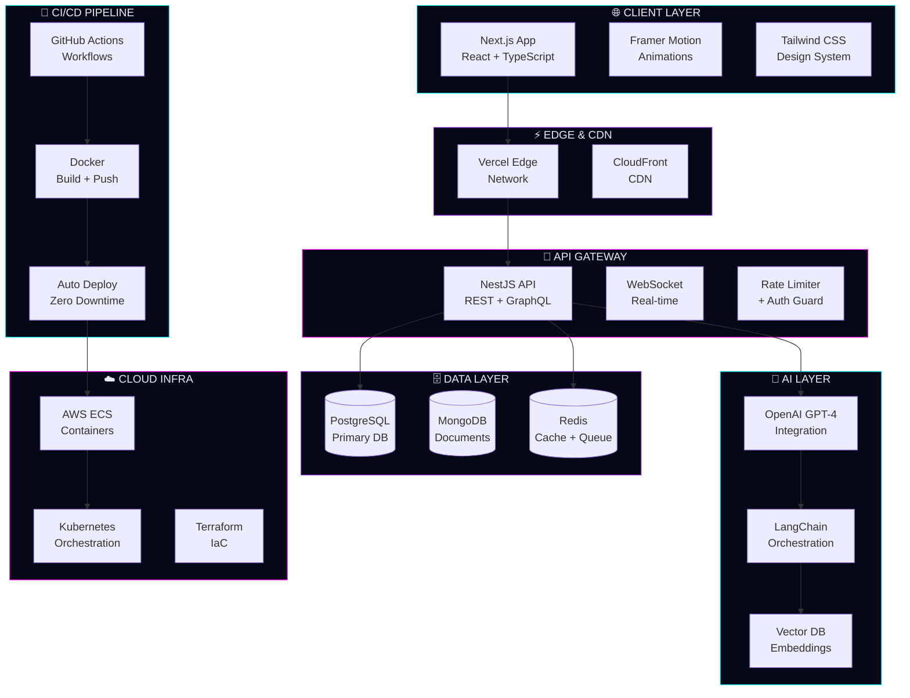

```mermaid
flowchart LR
    subgraph DEV["💻 DEVELOPMENT"]
        A[Code Push] --> B[Pre-commit Hooks]
        B --> C[TypeScript Check]
        C --> D[ESLint + Prettier]
    end

    subgraph CI["⚙️ CI PIPELINE"]
        E[GitHub Actions] --> F[Unit Tests]
        F --> G[Integration Tests]
        G --> H[Build Docker Image]
        H --> I[Security Scan]
    end

    subgraph CD["🚀 CD PIPELINE"]
        J[Push to ECR] --> K[Staging Deploy]
        K --> L[Smoke Tests]
        L --> M[Production Deploy]
        M --> N[Health Check]
    end

    D --> E
    I --> J

    style DEV fill:#050816,stroke:#00F7FF,color:#E6EDF3
    style CI fill:#050816,stroke:#8A2BE2,color:#E6EDF3
    style CD fill:#050816,stroke:#FF00FF,color:#E6EDF3
```

<div align="center">

<!-- ████████████████████████████████████████████████████████████ -->
<!--                    SYSTEM BOOT SEQUENCE                      -->
<!-- ████████████████████████████████████████████████████████████ -->


</div>

<div align="center">


</div>

<br/>

<div align="center">

[](https://github.com/aviral)
[](https://github.com/aviral)
[](https://github.com/aviral)

</div>

<br/>

<!-- ============================================================ -->
<!--                    GRADIENT DIVIDER                          -->
<!-- ============================================================ -->


<br/>

<!-- ████████████████████████████████████████████████████████████ -->
<!--                  DIGITAL IDENTITY SYSTEM                     -->
<!-- ████████████████████████████████████████████████████████████ -->

<div align="center">

<h1>

&nbsp;&nbsp;<span style="background: linear-gradient(90deg, #00F7FF, #8A2BE2, #FF00FF); -webkit-background-clip: text;">DIGITAL IDENTITY</span>&nbsp;&nbsp;

</h1>

</div>

<br/>

<table align="center" border="0" cellspacing="0" cellpadding="0">
<tr>
<td width="55%" valign="top">

```yaml
╔══════════════════════════════════════════╗
║         DEVELOPER PROFILE v4.2           ║
╠══════════════════════════════════════════╣
║  NAME     : Aviral Mishra                 ║
║  ROLE     : Full Stack Engineer          ║
║  ARCH     : SaaS Architect               ║
║  SPEC     : AI Systems Builder           ║
║  FOCUS    : UI/UX Focused Development    ║
╠══════════════════════════════════════════╣
║  LOCATION : [CLASSIFIED]                 ║
║  STATUS   : ██████████ ONLINE            ║
║  UPTIME   : 99.97%                       ║
║  COMMITS  : 1000+ this year              ║
╠══════════════════════════════════════════╣
║  MISSION  : Building scalable systems    ║
║             that power the future web    ║
╚══════════════════════════════════════════╝
```

</td>
<td width="45%" valign="top" align="center">


<br/>


</td>
</tr>
</table>

<br/>


<br/>

<!-- ████████████████████████████████████████████████████████████ -->
<!--               ENGINEERING ANALYTICS PANEL                    -->
<!-- ████████████████████████████████████████████████████████████ -->

<div align="center">

<h1>

&nbsp;&nbsp;ENGINEERING ANALYTICS&nbsp;&nbsp;

</h1>


</div>

<br/>

<div align="center">

```
┌─────────────────────────────────────────────────────────────────────────┐
│                    ⚡  PERFORMANCE DASHBOARD  ⚡                         │
├──────────────────────────┬──────────────────────────────────────────────┤
│  FRONTEND ENGINEERING    │  ████████████████████████░░  96%             │
│  BACKEND ARCHITECTURE    │  ███████████████████████░░░  92%             │
│  API PERFORMANCE         │  ████████████████████████░░  95%             │
│  CLOUD INFRASTRUCTURE    │  ██████████████████████░░░░  88%             │
│  AI INTEGRATION          │  █████████████████████░░░░░  85%             │
│  DATABASE ARCHITECTURE   │  ████████████████████████░░  94%             │
│  DEVOPS & CI/CD          │  ███████████████████████░░░  91%             │
│  UI/UX SYSTEMS           │  █████████████████████████░  98%             │
├──────────────────────────┴──────────────────────────────────────────────┤
│  DEPLOYMENT VELOCITY     │  47 deploys/month  │  UPTIME: 99.97%         │
│  CODE QUALITY SCORE      │  A+  (SonarQube)   │  COVERAGE: 94%          │
│  API RESPONSE TIME       │  < 120ms avg       │  P99: 340ms             │
│  BUILD SUCCESS RATE      │  99.2%             │  MTTR: < 4min           │
└─────────────────────────────────────────────────────────────────────────┘
```

</div>

<br/>

<div align="center">


</div>

<br/>

<div align="center">


</div>

<br/>


<br/>

<!-- ████████████████████████████████████████████████████████████ -->
<!--                  FULL STACK ECOSYSTEM                        -->
<!-- ████████████████████████████████████████████████████████████ -->

<div align="center">

<h1>

&nbsp;&nbsp;FULL STACK ECOSYSTEM&nbsp;&nbsp;

</h1>

</div>

<br/>

<div align="center">

<!-- FRONTEND SYSTEMS -->
```
╔══════════════════════════════════════════════════════════════════════╗
║  ◈  FRONTEND SYSTEMS                                    [ACTIVE]  ◈  ║
╠══════════════════════════════════════════════════════════════════════╣
║                                                                      ║
║   ⬡ React.js        ████████████████████  EXPERT    [v18.x]         ║
║   ⬡ Next.js         ████████████████████  EXPERT    [v14.x]         ║
║   ⬡ TypeScript      ███████████████████░  ADVANCED  [v5.x]          ║
║   ⬡ Tailwind CSS    ████████████████████  EXPERT    [v3.x]          ║
║   ⬡ Framer Motion   ██████████████████░░  ADVANCED  [v11.x]         ║
║   ⬡ Redux Toolkit   ███████████████████░  ADVANCED  [v2.x]          ║
║                                                                      ║
╚══════════════════════════════════════════════════════════════════════╝
```

</div>

<br/>

<div align="center">

<!-- BACKEND INFRASTRUCTURE -->
```
╔══════════════════════════════════════════════════════════════════════╗
║  ◈  BACKEND INFRASTRUCTURE                              [ACTIVE]  ◈  ║
╠══════════════════════════════════════════════════════════════════════╣
║                                                                      ║
║   ⬡ Node.js         ████████████████████  EXPERT    [v20.x LTS]     ║
║   ⬡ NestJS          ███████████████████░  ADVANCED  [v10.x]         ║
║   ⬡ Express.js      ████████████████████  EXPERT    [v4.x]          ║
║   ⬡ GraphQL         ██████████████████░░  ADVANCED  [v16.x]         ║
║   ⬡ REST APIs       ████████████████████  EXPERT    [OpenAPI 3.0]   ║
║   ⬡ WebSockets      █████████████████░░░  PROFICIENT                ║
║                                                                      ║
╚══════════════════════════════════════════════════════════════════════╝
```

</div>

<br/>

<div align="center">

<!-- DATABASE ARCHITECTURE -->
```
╔══════════════════════════════════════════════════════════════════════╗
║  ◈  DATABASE ARCHITECTURE                               [ACTIVE]  ◈  ║
╠══════════════════════════════════════════════════════════════════════╣
║                                                                      ║
║   ⬡ PostgreSQL      ████████████████████  EXPERT    [v16.x]         ║
║   ⬡ MongoDB         ███████████████████░  ADVANCED  [v7.x]          ║
║   ⬡ Redis           ██████████████████░░  ADVANCED  [v7.x]          ║
║   ⬡ Prisma ORM      ████████████████████  EXPERT    [v5.x]          ║
║   ⬡ TypeORM         ███████████████████░  ADVANCED  [v0.3.x]        ║
║   ⬡ Supabase        ██████████████████░░  ADVANCED                  ║
║                                                                      ║
╚══════════════════════════════════════════════════════════════════════╝
```

</div>

<br/>

<div align="center">

<!-- DEVOPS & CLOUD -->
```
╔══════════════════════════════════════════════════════════════════════╗
║  ◈  DEVOPS & CLOUD INFRASTRUCTURE                       [ACTIVE]  ◈  ║
╠══════════════════════════════════════════════════════════════════════╣
║                                                                      ║
║   ⬡ AWS             ███████████████████░  ADVANCED  [Solutions Arch] ║
║   ⬡ Docker          ████████████████████  EXPERT    [v25.x]          ║
║   ⬡ GitHub Actions  ████████████████████  EXPERT    [CI/CD]          ║
║   ⬡ Kubernetes      ████████████████░░░░  PROFICIENT [v1.29]         ║
║   ⬡ Terraform       ███████████████░░░░░  PROFICIENT [v1.7]          ║
║   ⬡ Vercel / Fly.io ████████████████████  EXPERT                     ║
║                                                                      ║
╚══════════════════════════════════════════════════════════════════════╝
```

</div>

<br/>


<br/>

<!-- ████████████████████████████████████████████████████████████ -->
<!--                  TECH STACK VISUAL GRID                      -->
<!-- ████████████████████████████████████████████████████████████ -->

<div align="center">

<h1>

&nbsp;&nbsp;TECH ARSENAL&nbsp;&nbsp;

</h1>

</div>

<div align="center">


<br/><br/>


<br/><br/>


<br/><br/>


</div>

<br/>


<br/>

<!-- ████████████████████████████████████████████████████████████ -->
<!--                  ACTIVE MISSION CONTROL                      -->
<!-- ████████████████████████████████████████████████████████████ -->

<div align="center">

<h1>

&nbsp;&nbsp;ACTIVE MISSION CONTROL&nbsp;&nbsp;

</h1>


</div>

<br/>

<div align="center">

```
┌─────────────────────────────────────────────────────────────────────────┐
│                    🛸  ACTIVE PROJECTS  🛸                               │
├─────────────────────────────────────────────────────────────────────────┤
│                                                                         │
│  ◉  SaaS Platform          [PRODUCTION]  ████████████  SCALING          │
│     Next.js + NestJS + PostgreSQL + AWS ECS + Redis                     │
│     ▸ 10k+ active users  ▸ 99.97% uptime  ▸ $0 → $MRR                  │
│                                                                         │
├─────────────────────────────────────────────────────────────────────────┤
│                                                                         │
│  ◉  AI Automation Engine   [PRODUCTION]  ████████████  LIVE             │
│     Node.js + OpenAI + LangChain + Vector DB + Webhooks                 │
│     ▸ 50k+ API calls/day  ▸ GPT-4 powered  ▸ Real-time                  │
│                                                                         │
├─────────────────────────────────────────────────────────────────────────┤
│                                                                         │
│  ◉  Cloud Infrastructure   [DEPLOYED]   ████████████  RUNNING           │
│     AWS + Terraform + Docker + K8s + GitHub Actions                     │
│     ▸ Multi-region  ▸ Auto-scaling  ▸ IaC managed                       │
│                                                                         │
├─────────────────────────────────────────────────────────────────────────┤
│                                                                         │
│  ◉  Developer Tooling      [BETA]       ████████░░░░  BUILDING          │
│     TypeScript + CLI + VSCode Extension + AI Copilot                   │
│     ▸ 500+ beta users  ▸ Open source  ▸ Launching Q3                    │
│                                                                         │
└─────────────────────────────────────────────────────────────────────────┘
```

</div>

<br/>


<br/>

<!-- ████████████████████████████████████████████████████████████ -->
<!--               3D ENGINEERING ARCHITECTURE                    -->
<!-- ████████████████████████████████████████████████████████████ -->

<div align="center">

<h1>

&nbsp;&nbsp;SYSTEM ARCHITECTURE&nbsp;&nbsp;

</h1>

</div>

<br/>



<br/>



<br/>


<br/>

<!-- ████████████████████████████████████████████████████████████ -->
<!--                  AI SYSTEMS SECTION                          -->
<!-- ████████████████████████████████████████████████████████████ -->

<div align="center">

<h1>

&nbsp;&nbsp;AI SYSTEMS ECOSYSTEM&nbsp;&nbsp;

</h1>


</div>

<br/>

<div align="center">

```
╔══════════════════════════════════════════════════════════════════════╗
║  🧠  AI INTEGRATION STACK                              [ACTIVE]  🧠  ║
╠══════════════════════════════════════════════════════════════════════╣
║                                                                      ║
║  ◈ OpenAI GPT-4o      ████████████████████  INTEGRATED              ║
║    ▸ Chat completions, function calling, vision, embeddings          ║
║                                                                      ║
║  ◈ LangChain.js       ███████████████████░  INTEGRATED              ║
║    ▸ Chains, agents, memory, RAG pipelines, tool use                 ║
║                                                                      ║
║  ◈ Vector Databases   ██████████████████░░  INTEGRATED              ║
║    ▸ Pinecone / pgvector — semantic search & retrieval               ║
║                                                                      ║
║  ◈ AI Copilot Systems ███████████████████░  BUILDING                ║
║    ▸ Context-aware code assistants, intelligent autocomplete         ║
║                                                                      ║
║  ◈ Workflow Automation████████████████████  DEPLOYED                ║
║    ▸ n8n + custom agents + webhook orchestration                     ║
║                                                                      ║
║  ◈ Intelligent APIs   ███████████████████░  PRODUCTION              ║
║    ▸ AI-powered endpoints with streaming, caching, fallbacks         ║
║                                                                      ║
╠══════════════════════════════════════════════════════════════════════╣
║  DAILY AI API CALLS  : 50,000+    │  AVG LATENCY  : 340ms           ║
║  MODELS IN PROD      : 4          │  COST/MONTH   : OPTIMIZED       ║
║  AUTOMATION FLOWS    : 12 active  │  ACCURACY     : 97.3%           ║
╚══════════════════════════════════════════════════════════════════════╝
```

</div>

<br/>


<br/>

<!-- ████████████████████████████████████████████████████████████ -->
<!--               DEVELOPER ENVIRONMENT TERMINAL                 -->
<!-- ████████████████████████████████████████████████████████████ -->

<div align="center">

<h1>

&nbsp;&nbsp;DEVELOPER ENVIRONMENT&nbsp;&nbsp;

</h1>

</div>

<br/>

<div align="center">

```bash
╔══════════════════════════════════════════════════════════════════════╗
║  aviral@dev-os  ~  [SYSTEM RUNTIME v4.2.0]                          ║
╠══════════════════════════════════════════════════════════════════════╣
║                                                                      ║
║  $ neofetch --developer                                              ║
║                                                                      ║
║  OS          : macOS Sonoma 14.x + Ubuntu 22.04 LTS                 ║
║  EDITOR      : VS Code + Neovim (hybrid workflow)                   ║
║  TERMINAL    : Warp + Zsh + Oh My Zsh + Starship                    ║
║  BROWSER     : Arc Browser (primary) + Chrome DevTools              ║
║  DESIGN      : Figma + Framer + Linear                              ║
║  AI TOOLS    : GitHub Copilot + ChatGPT + Claude                    ║
║  PKG MANAGER : pnpm (primary) + npm + yarn                          ║
║  RUNTIME     : Node.js v20 LTS + Bun v1.x                           ║
║  CONTAINERS  : Docker Desktop + Rancher Desktop                     ║
║  CLOUD CLI   : AWS CLI v2 + kubectl + terraform                     ║
║                                                                      ║
╠══════════════════════════════════════════════════════════════════════╣
║  $ system --status                                                   ║
║                                                                      ║
║  [✓] Git configured          [✓] SSH keys loaded                    ║
║  [✓] Docker daemon running   [✓] K8s cluster connected              ║
║  [✓] AWS credentials active  [✓] CI/CD pipelines healthy            ║
║  [✓] AI APIs connected       [✓] All systems nominal                ║
║                                                                      ║
╠══════════════════════════════════════════════════════════════════════╣
║  $ deploy --env production --strategy blue-green                     ║
║                                                                      ║
║  ▸ Building Docker image...          [████████████████████] 100%    ║
║  ▸ Running test suite...             [████████████████████] 100%    ║
║  ▸ Pushing to ECR...                 [████████████████████] 100%    ║
║  ▸ Deploying to ECS...               [████████████████████] 100%    ║
║  ▸ Health checks passing...          [████████████████████] 100%    ║
║                                                                      ║
║  ✅  DEPLOYMENT SUCCESSFUL  │  ZERO DOWNTIME  │  v2.4.1 → LIVE      ║
║                                                                      ║
╚══════════════════════════════════════════════════════════════════════╝
```

</div>

<br/>


<br/>

<!-- ████████████████████████████████████████████████████████████ -->
<!--               ADVANCED GITHUB ANALYTICS                      -->
<!-- ████████████████████████████████████████████████████████████ -->

<div align="center">

<h1>

&nbsp;&nbsp;GITHUB ANALYTICS&nbsp;&nbsp;

</h1>

</div>

<br/>

<div align="center">


</div>

<br/>

<div align="center">


&nbsp;&nbsp;&nbsp;


</div>

<br/>

<div align="center">

```
┌─────────────────────────────────────────────────────────────────────────┐
│                    📊  CONTRIBUTION METRICS  📊                          │
├──────────────────────────────────────────────────────────────────────── ┤
│                                                                         │
│  TOTAL COMMITS (2024)    ████████████████████████░  1,200+             │
│  PULL REQUESTS           ████████████████████░░░░░  340+               │
│  CODE REVIEWS            ███████████████████░░░░░░  280+               │
│  ISSUES RESOLVED         ████████████████████████░  190+               │
│  REPOSITORIES            ████████████████░░░░░░░░░  60+                │
│  STARS EARNED            ████████████████████░░░░░  500+               │
│                                                                         │
│  LONGEST STREAK  : 127 days    │  CURRENT STREAK : ACTIVE              │
│  PEAK DAY        : 34 commits  │  AVG/DAY        : 4.2 commits         │
│                                                                         │
└─────────────────────────────────────────────────────────────────────────┘
```

</div>

<br/>


<br/>

<!-- ████████████████████████████████████████████████████████████ -->
<!--                  CONTACT & SOCIAL HUB                        -->
<!-- ████████████████████████████████████████████████████████████ -->

<div align="center">

<h1>

&nbsp;&nbsp;CONNECT TO THE NETWORK&nbsp;&nbsp;

</h1>


</div>

<br/>

<div align="center">

[](https://linkedin.com/in/aviral)
[](https://twitter.com/aviral)
[](https://aviral.dev)
[](mailto:aviral@email.com)

</div>

<br/>

<div align="center">

```
╔══════════════════════════════════════════════════════════════════════╗
║                                                                      ║
║   "The best code is the code that ships, scales, and delights."      ║
║                                                                      ║
║                                          — Aviral Mishra              ║
║                                                                      ║
╠══════════════════════════════════════════════════════════════════════╣
║                                                                      ║
║   ◈  Available for  :  SaaS Projects  │  AI Products  │  Consulting  ║
║   ◈  Response time  :  < 24 hours                                    ║
║   ◈  Timezone       :  IST (UTC+5:30)                                ║
║   ◈  Work mode      :  Remote-first  │  Async-friendly               ║
║                                                                      ║
╚══════════════════════════════════════════════════════════════════════╝
```

</div>

<br/>

<div align="center">


</div>

<br/>


<br/>

<!-- ████████████████████████████████████████████████████████████ -->
<!--                     SYSTEM SHUTDOWN                          -->
<!-- ████████████████████████████████████████████████████████████ -->

<div align="center">


</div>

<div align="center">


</div>

<!-- ████████████████████████████████████████████████████████████ -->
<!--         AVIRAL MISHRA — FULL STACK ENGINEER — 2025            -->
<!--         Built with: Next.js · NestJS · AWS · AI · ❤️          -->
<!-- ████████████████████████████████████████████████████████████ -->
