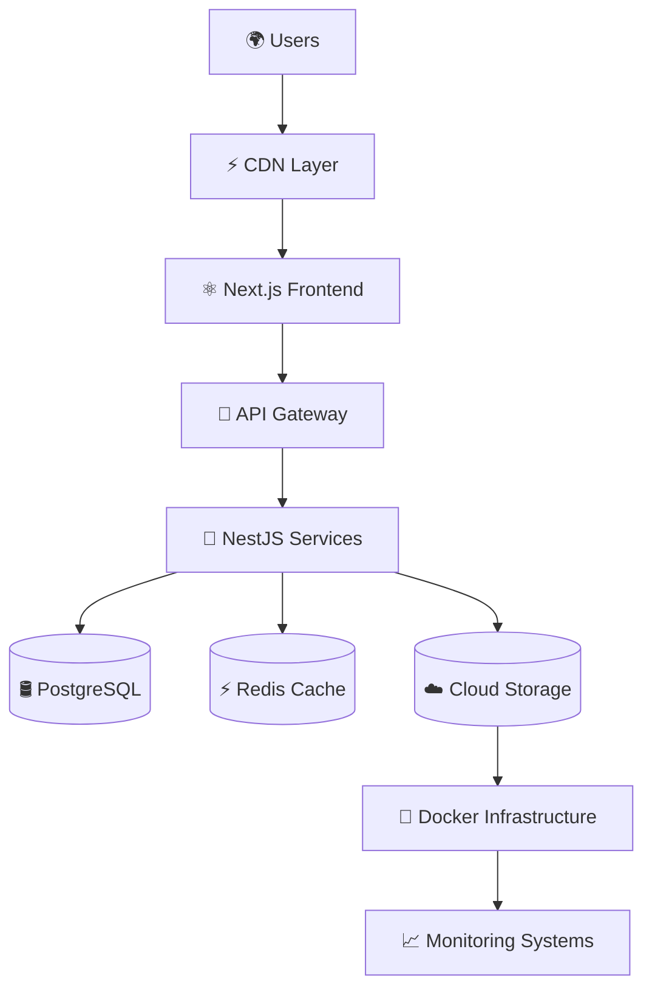

]<!-- ========================================= -->
<!-- 🌌 AVIRAL OS — FUTURISTIC DEV README -->
<!-- ========================================= -->

<div align="center">


<br/>


<br/><br/>

<a href="https://github.com/Aviral-1">

</a>


</div>

---

# 🌌 SYSTEM OVERVIEW

<div align="center">


</div>

<br/>

```bash
┌──────────────────────────────────────────────┐
│ AVIRAL MISHRA                               │
├──────────────────────────────────────────────┤
│ ROLE        → Full Stack Engineer           │
│ SPECIALITY  → SaaS Architecture             │
│ STACK       → MERN + Next.js                │
│ CLOUD       → AWS + Docker                  │
│ AI SYSTEMS  → OpenAI Integrations           │
│ STATUS      → BUILDING THE FUTURE           │
└──────────────────────────────────────────────┘
```

---

# ⚡ ENGINEERING DASHBOARD

<div align="center">


</div>

<br/>

```yaml
SYSTEM_STATUS:
  Runtime: ONLINE

CURRENT_BUILD:
  - Smart SaaS ERP
  - AI Workflow Systems
  - Cloud Infrastructure

TECH_STACK:
  Frontend:
    - React.js
    - Next.js
    - TypeScript
    - Tailwind CSS

  Backend:
    - Node.js
    - NestJS
    - PostgreSQL
    - MongoDB

  Cloud:
    - Docker
    - AWS
    - CI/CD
    - Linux
```

---

# 🚀 ACTIVE MISSIONS

<div align="center">


</div>

<br/>

```txt
[ CURRENT PROJECTS ]

◉ Smart Waste ERP Platform
◉ SaaS Dashboard Ecosystem
◉ AI Automation Systems
◉ Cloud Native Applications
◉ Production Scale APIs
◉ High Performance UI Systems
```

---

# 🌐 FULL STACK ECOSYSTEM

<div align="center">

<table>
<tr>

<td width="33%" align="center">

## ⚛️ FRONTEND


<br/><br/>

```txt
Modern UI Systems
Responsive Interfaces
Motion Animations
SaaS Dashboards
Frontend Architecture
Performance Optimization
```

</td>

<td width="33%" align="center">

## 🚀 BACKEND


<br/><br/>

```txt
REST APIs
Authentication
Scalable Systems
Database Design
Microservices
Production APIs
```

</td>

<td width="33%" align="center">

## ☁️ DEVOPS


<br/><br/>

```txt
Docker Systems
AWS Infrastructure
CI/CD Pipelines
Automation
Monitoring
Cloud Deployment
```

</td>

</tr>
</table>

</div>

---

# 🧠 AI ENGINEERING SYSTEM

<div align="center">


</div>

<br/>

```txt
AI SYSTEMS
│
├── OpenAI Integrations
├── AI Workflow Pipelines
├── Automation Systems
├── Smart SaaS Features
├── AI Chat Platforms
└── Intelligent User Experiences
```

---

# ☁️ CLOUD ARCHITECTURE

<div align="center">



</div>

---

# 📊 GITHUB ANALYTICS

<div align="center">


<br/><br/>


</div>

---

# 🐍 CONTRIBUTION MATRIX

<div align="center">


</div>

---

# 🏆 ACHIEVEMENTS

<div align="center">


</div>

---

# 🎧 LIVE TERMINAL

<div align="center">


</div>

---

# 🌐 CONNECT SYSTEM

<div align="center">

<a href="https://github.com/Aviral-1">

</a>

<a href="https://linkedin.com">

</a>

<a href="mailto:yourmail@gmail.com">

</a>

<a href="https://twitter.com">

</a>

</div>

---

# ⚡ ENGINEERING PHILOSOPHY

<div align="center">

### Building scalable SaaS ecosystems with modern frontend engineering, cloud infrastructure, and AI-powered systems.

</div>

---

<div align="center">


</div>

