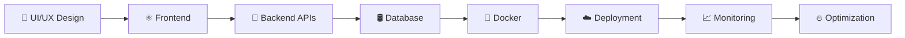

<!-- 🌌 AVIRAL MISHRA — ULTRA MODERN ANIMATED GITHUB README 🌌 -->

<div align="center">


<br/><br/>


</div>

---

#  About Me


```yaml
name: Aviral Mishra

role: Full Stack Developer

specialization:
  - React.js
  - Next.js
  - NestJS
  - TypeScript
  - Docker
  - DevOps

currently_learning:
  - AWS
  - CI/CD Pipelines
  - System Design
  - Scalable Architectures

focus:
  - SaaS Development
  - UI/UX Enhancement
  - Performance Optimization
  - Production Problem Solving

motto:
  "Code. Build. Scale. Repeat."
```

<br clear="both"/>

---

# ⚡ Tech Stack

<div align="center">


</div>

---

# 🚀 Animated GitHub Metrics

<div align="center">


<br/><br/>


<br/><br/>


</div>

---

# 📊 Live Contribution Graph

<div align="center">


</div>

---

# 🏆 GitHub Achievements

<div align="center">


</div>

---

# 🐍 Snake Contribution Animation

<div align="center">


</div>

---

# 🌌 3D Contribution Calendar

<div align="center">


</div>

---

# 🔥 WakaTime Coding Stats

<div align="center">


</div>

---

# ⚡ GitHub Skyline

<div align="center">


</div>

---

# 🎯 Current Focus

<div align="center">

<table>

<tr>

<td align="center" width="33%">


### ⚛️ Frontend

```diff
+ Next.js
+ Framer Motion
+ Animations
+ Performance
```

</td>

<td align="center" width="33%">


### 🚀 Backend

```yaml
- NestJS
- REST APIs
- Architecture
- Optimization
```

</td>

<td align="center" width="33%">


### ☁️ DevOps

```bash
Docker
AWS
CI/CD
Automation
```

</td>

</tr>

</table>

</div>

---

# 💻 Animated Workflow

<div align="center">



</div>

---

# 🎧 Spotify Coding Mode

<div align="center">


</div>

---

# 🌐 Connect With Me

<div align="center">

<a href="https://github.com/Aviral-1">

</a>

<a href="https://linkedin.com/in/yourlinkedin">

</a>

<a href="mailto:youremail@example.com">

</a>

<a href="https://twitter.com/">

</a>

<a href="https://discord.com">

</a>

</div>

---

# 😂 Random Dev Joke

<div align="center">


</div>

---

# 💀 Terminal Animation

<div align="center">


</div>

---

# 🌌 Dynamic Quote

<div align="center">


</div>

---

# ⚡ Developer Mood

<div align="center">


</div>

---

<div align="center">


# ⚡ Code • Create • Scale • Repeat ⚡


</div>
