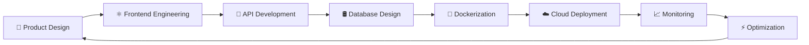
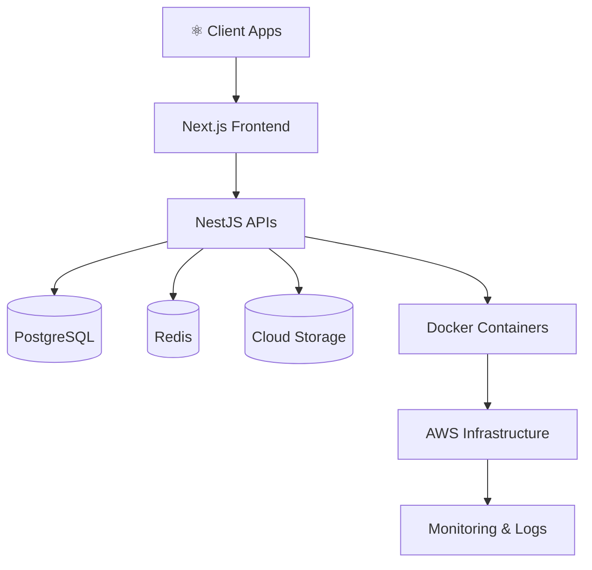

<!-- ========================================= -->
<!-- 🚀 AVIRAL MISHRA — ELITE DEV README -->
<!-- ========================================= -->

<div align="center">


<br/>


<br/>


</div>

---

# ⚡ About Me


```yaml
name: Aviral Mishra

role: Full Stack Engineer

specialization:
  - Modern SaaS Applications
  - Frontend Architecture
  - Backend Systems
  - DevOps & Automation
  - High Performance UI

tech_stack:
  frontend:
    - React.js
    - Next.js
    - TypeScript
    - Tailwind CSS
    - Framer Motion

  backend:
    - Node.js
    - NestJS
    - Express.js
    - PostgreSQL
    - MongoDB

  devops:
    - Docker
    - AWS
    - CI/CD
    - GitHub Actions
    - Linux

currently_learning:
  - Scalable System Design
  - Kubernetes
  - Cloud Infrastructure
  - AI Integrations

motto:
  "Design • Develop • Deploy • Scale"
```

<br clear="both"/>

---

# ⚡ Tech Arsenal

<div align="center">


</div>

---

# 🧠 Developer Mindset

<div align="center">

| 🚀 Focus Area | ⚡ Expertise |
|---|---|
| Frontend Engineering | Scalable UI Systems |
| Backend Architecture | REST APIs & Optimization |
| DevOps | CI/CD & Deployments |
| Problem Solving | Production Debugging |
| UI/UX | Modern Product Design |
| Performance | Speed & Scalability |

</div>

---

# 🚀 GitHub Analytics

<div align="center">


<br/><br/>


<br/><br/>


</div>

---

# 📈 Contribution Graph

<div align="center">


</div>

---

# 🐍 Contribution Snake

<div align="center">


</div>

---

# 🏆 Achievement Showcase

<div align="center">


</div>

---

# 🌌 3D Contributions

<div align="center">


</div>

---

# 🚀 Current Engineering Focus

<div align="center">

<table>

<tr>

<td align="center" width="33%">


### ⚛️ Frontend

```diff
+ Next.js 15
+ Tailwind CSS
+ Framer Motion
+ Responsive UI
+ SaaS Dashboard Design
```

</td>

<td align="center" width="33%">


### 🚀 Backend

```yaml
- NestJS
- REST APIs
- Authentication
- PostgreSQL
- Performance Optimization
```

</td>

<td align="center" width="33%">


### ☁️ DevOps

```bash
Docker
AWS
GitHub Actions
CI/CD Pipelines
Linux Servers
```

</td>

</tr>

</table>

</div>

---

# ⚡ Developer Workflow

<div align="center">



</div>

---

# 🧩 Architecture Vision

<div align="center">



</div>

---

# ⚡ WakaTime Activity

<div align="center">


</div>

---

# 🎧 Coding Mode

<div align="center">


</div>

---

# 🌐 Connect With Me

<div align="center">

<a href="https://github.com/Aviral-1">

</a>

<a href="https://linkedin.com/in/yourlinkedin">

</a>

<a href="mailto:youremail@example.com">

</a>

<a href="https://twitter.com/">

</a>

<a href="https://discord.com">

</a>

</div>

---

# 💻 Terminal

<div align="center">


</div>

---

# 😂 Random Dev Joke

<div align="center">


</div>

---

# 🌌 Developer Philosophy

<div align="center">


</div>

---

# ⚡ Dev Lifestyle

<div align="center">


</div>

---

# 🧠 Fun Fact

<div align="center">

```diff
+ I love building modern SaaS products
+ Passionate about clean UI & scalable systems
+ Turning ideas into production-ready applications
+ Debugging at 2AM like a true developer 🚀
```

</div>

---

<div align="center">


</div>
