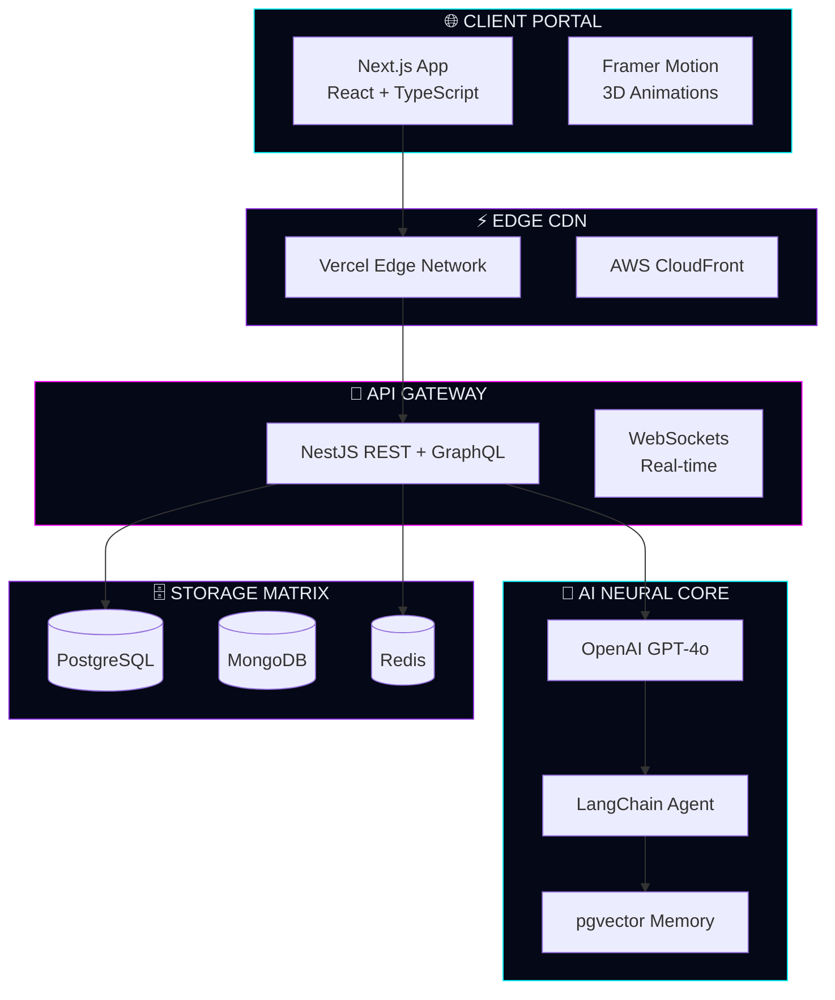
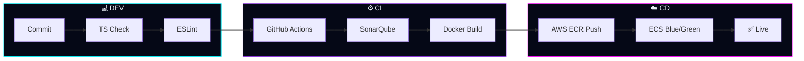

<!-- ============================================================ -->
<!-- 🚀 AVIRAL MISHRA — CYBERNETIC DEV OBSERVABILITY GRID v6.0   -->
<!-- ============================================================ -->

 

  

&nbsp;&nbsp;

&nbsp;&nbsp;

---

## 📊 GitHub Analytics Grid

---

## 📈 Language & Activity Radar

&nbsp;&nbsp;

 

&nbsp;

&nbsp;

---

## 🐍 Contribution Constellation

<picture>
  <source media="(prefers-color-scheme: dark)" srcset="https://raw.githubusercontent.com/Aviral-1/Aviral-1/output/github-contribution-grid-snake-dark.svg"/>
  <source media="(prefers-color-scheme: light)" srcset="https://raw.githubusercontent.com/Aviral-1/Aviral-1/output/github-contribution-grid-snake.svg"/>
  
</picture>

---

## ⚡ Tech Arsenal

  

  

  

---

## 🧠 System Architecture

---

## 🚀 CI/CD Pipeline

---

## 🎧 Coding Soundtrack

---

## 💻 Terminal Loop

---

## 😂 Dev Humour Node

---

## 🌠 Philosophy Core

---

## ⚡ Engineering Ritual

---

## 🌐 Connect Grid

  

&nbsp;&nbsp;

&nbsp;&nbsp;

---

